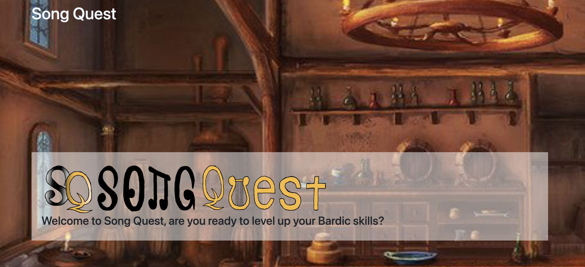
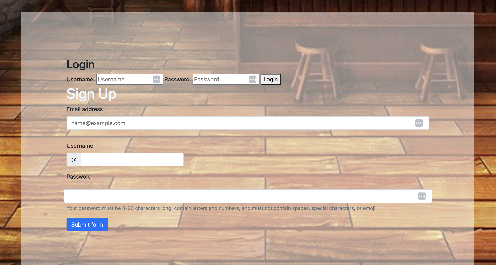
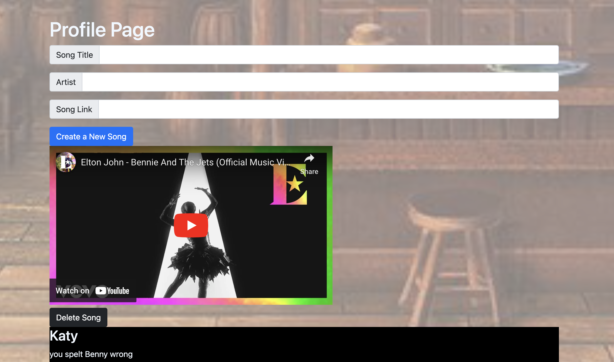

# SongQuest

## Description

SongQuest is a website for songwriters and music producers. The end user starts by either logging in or signing up as a user to upload music. In their profile, they are able to upload their music by song title, song link and author. Additionally, they are able to see other users, and their comments under youtube videos. The end user is able to add their own comments to the profile page. The website is a responsive, interactive and uses iFrame to embed Youtube videos.

## Table of Contents

- [Home Page](#homepage)
- [Profile Page](#profilepage)
- [Website Links](#websitelinks)
- [Technical Requirements](#technicalrequirements)
- [Credits](#credits)
- [License](#license)

  
## Home Page

  
## Profile Page

  
## Website Links

* Github Repo:https://github.com/lavollmer/songquest

* Heroku Link Deployment:https://songquest-67489ba089f5.herokuapp.com/

  
## Technical Requirements
Technical requirements of the website included:
* MVC Paradigm Structure
* Javascript for functionality
* JQUERY 
* Bootstrap CSS for styling
* Handlebars.js
* Express.js 
* Node.js
* Heroku Deployment
* Sequelize ORM
* mySQL2
* bcrypt
* dotenv
* iFrame Youtube Video Embed
* Express-Session and Cookies

Song link has to be the Youtube embed link found on share in order to function properly.

  
## Credits

This project was done in conjunction with the U of MN Bootcamp Fall 2023.

This website was created by Matt Stark, Zack Schreier, Sushi Lee and Laura Vollmer.

Tutoring services and TAs were used to help debug, help with logic and coding.

Activity 24 in Unit 14 MVC inspired and provided code for the signup, login, and logout sections of this project. 

  

## License
No license